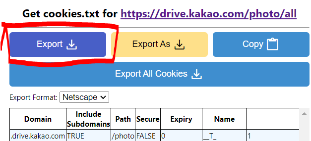

# 카카오톡 톡서랍 일괄 사진 백업

가장 오래전부터 저장된 사진부터 100개씩 묶어서 압축파일로 저장 후 톡서랍에서 삭제

- 쿠키 저장 확장 프로그램 설치 https://chrome.google.com/webstore/detail/get-cookiestxt-locally/cclelndahbckbenkjhflpdbgdldlbecc/
- 브라우저로 https://drive.kakao.com/photo/all 접속
- d쿠키 저장 확장 프로그램 export 후 파일을 파이썬 폴더에 저장
- main.py 실행

## 다른 분들이 기능을 추가한 버전들
- [southglory](https://github.com/Front-line-dev/talkdrive-backup/tree/southglory)
